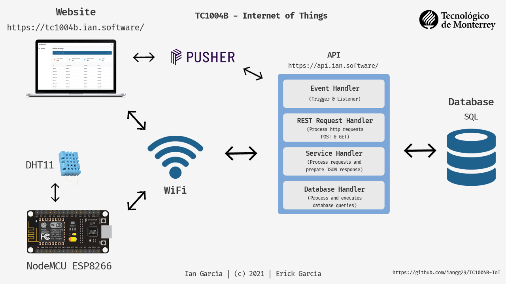

# Internet de las Cosas 📶

##### Implementación del Internet de las Cosas [TC1004B.5]

###### Ian García González y Erick García Huerta

## Problematica 🌱:

 A lo largo de las distintas eras de la humanidad la agricultura ha sido una de las actividades clave para la supervivencia del hombre, una de las prácticas más comunes es el almacenamiento de grano para la cosecha. A lo largo de las distintas zonas agrícolas se han ubicado enormes silos y almacenes donde toneladas de distintas semillas se almacenan para su posterior uso. Sin embargo este tipo de almacenamiento es un problema en sí debido a algunas peculiaridades del mismo. 

 La combustión espontánea del grano es un problema al que se suelen enfrentar los granjeros al momento de mantener sus cosechas seguras. El proceso a través del que se lleva a cabo este fenómeno tiene dos factores principales: la temperatura y la humedad. Los granos de girasol y lino son susceptibles a este tipo de acción, esto se debe a que las semillas son un mal conductor del calor, por lo que distintos puntos calientes suelen formarse a lo largo de los silos los cuales al contacto con el oxígeno del ambiente, combinado con los aceites naturales que generan las semillas entran en combustión. En relación a la humedad, los puntos calientes del silo suelen absorber más humedad que los puntos fríos, lo cual además de poner en riesgo de ignición el grano, aceleran el proceso de fermentación del mismo, llegando a reducir la vida del mismo hasta los 15 días a una temperatura del 30° (Leza, Escriña & Asociados S.A, S.f.). 

## Cliente 👨🏻‍🌾:

 Debido a la naturaleza del problema, el sector que más se vería beneficiado de nuestro proyecto sería el agricultor. De esta manera ellos podrían ubicar los sensores en distintas partes de los silos para monitorear la creación de distintos puntos calientes. 

## Arquitectura:

## Sensores:

 Sensor de temperatura y humedad DHT11. ❄️🔥

El DHT11 es un sensor de temperatura y humedad de uso común . El sensor viene con un NTC dedicado para medir la temperatura y un microcontrolador de 8 bits para generar los valores de temperatura y humedad como datos en serie. El sensor también se calibra en fábrica y, por lo tanto, es fácil de conectar con otros microcontroladores.

El sensor puede medir la temperatura de 0 ° C a 50 ° C y la humedad de 20% a 90% con una precisión de ± 1 ° C y ± 1%.

Especificaciones Técnicas

<ul>
  <li><b>Voltaje de funcionamiento:</b>  3.5V ~ 5.5V</li>
  <li><b>Corriente de funcionamiento:</b> 0,3 mA (medición) 60 uA (en espera)</li>
  <li><b>Salida:</b> Datos seriales</li>
  <li><b>Rango de temperatura:</b> 0 °C a 50 °C</li>
  <li><b>Rango de humedad:</b> 20% a 90%</li>
  <li><b>Resolución:</b> temperatura y humedad ambos 16 bits</li>
  <li><b>Precisión:</b> ± 1 °C y ± 1%</li>
</ul>

## Elemento de procesamiento elegido:

 Modulo Wifi Esp8266 Lua Node MCU. 📶

El NodeMcu es un kit de desarrollo de código abierto basado en el popular chip ESP8266 (ESP - 12F), que utiliza el lenguaje de programación Lua para crear un ambiente de desarrollo propicio para aplicaciones que requiera conectividad Wifi de manera rápida. Ofrece una solución completa y autónoma de redes WiFi, lo que le permite alojar la aplicación o servir como puente entre Internet y un microcontrolador.

Especificaciones Técnicas

<ul>
  <li><b>Dimensiones:</b> 58 x 31 x 13 mm • Peso: 10.21 g</li>
  <li><b>Tensión de funcionamiento:</b> 3 ~ 5 V</li>
  <li><b>Módulo:</b> WiFi ESP8266-MOD</li>
  <li><b>Antena:</b> PCB</li>
  <li><b>Protocolos soportados:</b> I2C, SPI, Serie, 1-Wire</li>
  <li><b>Nivel de señal:</b> TTL</li>
  <li><b>USB Transceiver:</b> CH340</li>
  <li><b>Número de pines GPIO:</b> 13</li>
  <li><b>Número de pines PWM:</b> 12</li>
</ul>

Puede integrarse con sensores y dispositivos específicos de aplicación a través de sus GPIOs con un desarrollo mínimo y carga mínima durante el tiempo de ejecución.

Su alto grado de integración en el chip permite una circuitería externa mínima, y la totalidad de la solución, incluyendo el módulo está diseñado para ocupar el área mínima en un PCB.

## Construido con 🛠️

* [NodeMCU](https://en.wikipedia.org/wiki/NodeMCU)
* [GoLang](https://golang.org/)
* [ReactJS](https://reactjs.org/)
* [TypeScript](https://www.typescriptlang.org/)
* [MySQL](https://www.mysql.com/)

## Autores ✒️

* **Ian García** (A01706892) - [iangg29](https://github.com/iangg29)
* **Erick García** (A01708119) - [alfredohuerta](https://github.com/alfredohuerta)

## Referencias 📃

* El seguro en acción (2012) La combustión espontánea y la fermentación en el seguro contra incendio de silos para
  productos de la agricultura. https://www.elseguroenaccion.com.ar/?p=1687
* Leza, Escriña & Asociados S.A (S.f.) Combustión Espontánea de granos -
  Definiciones. https://www.lea-global.com/uploads/circulares/2015/09/1_combustion_espontanea_de_granos.pdf
* Peralta M. (2019) Si usás bolsa de semillas para microondas ¡cuidado con la combustión
  espontánea! https://970universal.com/2019/07/10/si-usas-bolsa-de-semillas-para-microondas-cuidado-con-la-combustion-espontanea/
* Wikipedia (2020) Combustión espontánea. https://es.wikipedia.org/wiki/Combustión_espontánea

## Licencia 📄

Este proyecto está bajo la Licencia (GNU General Public License v3.0) - mira el archivo [LICENSE.md](LICENSE.md) para
detalles

---
Ian García | Erick García | &copy; 2021